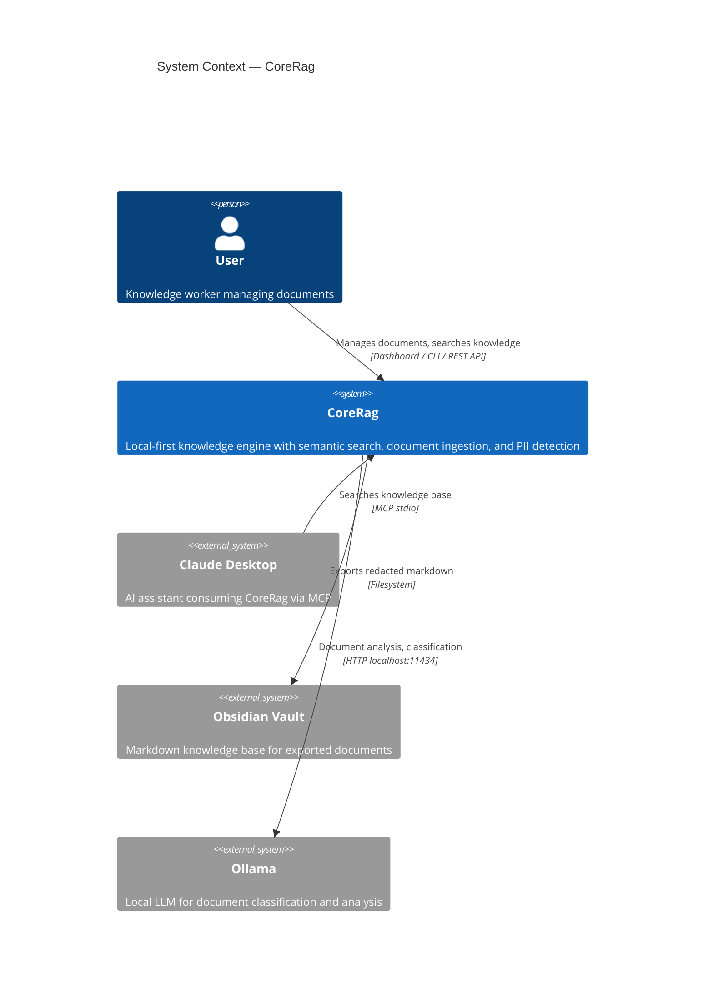
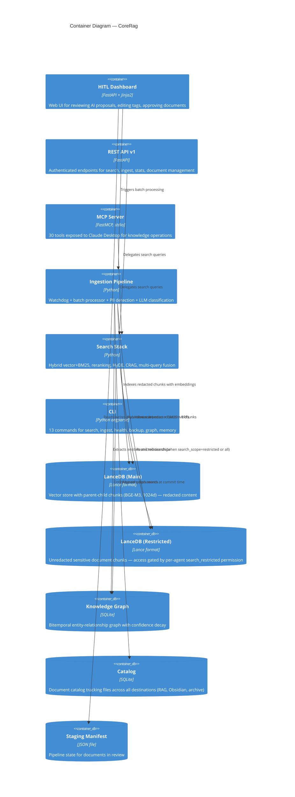
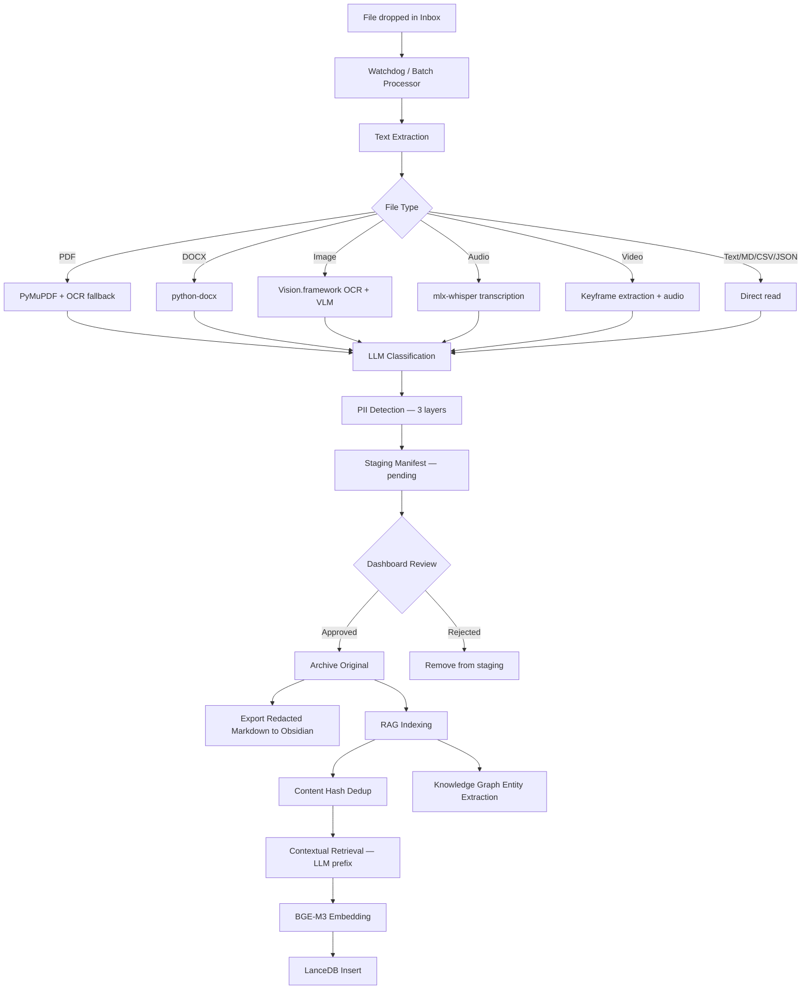
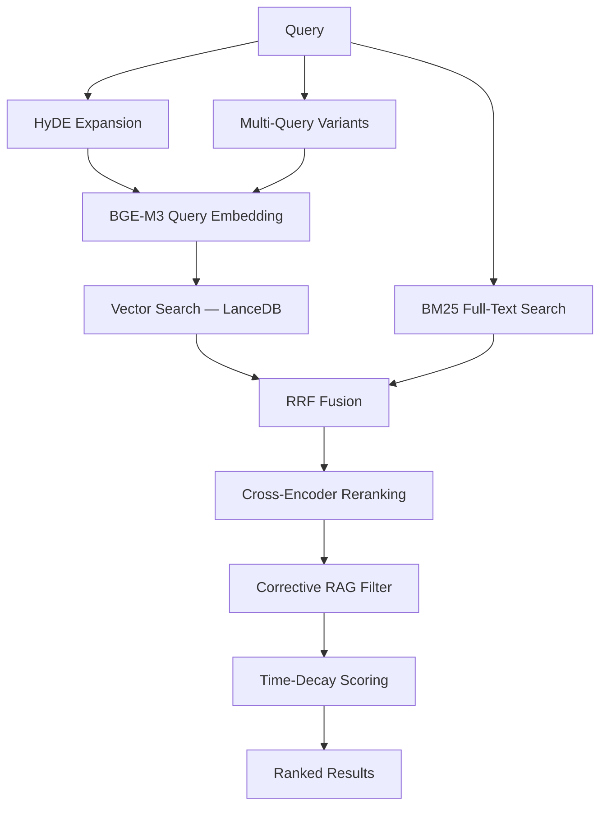
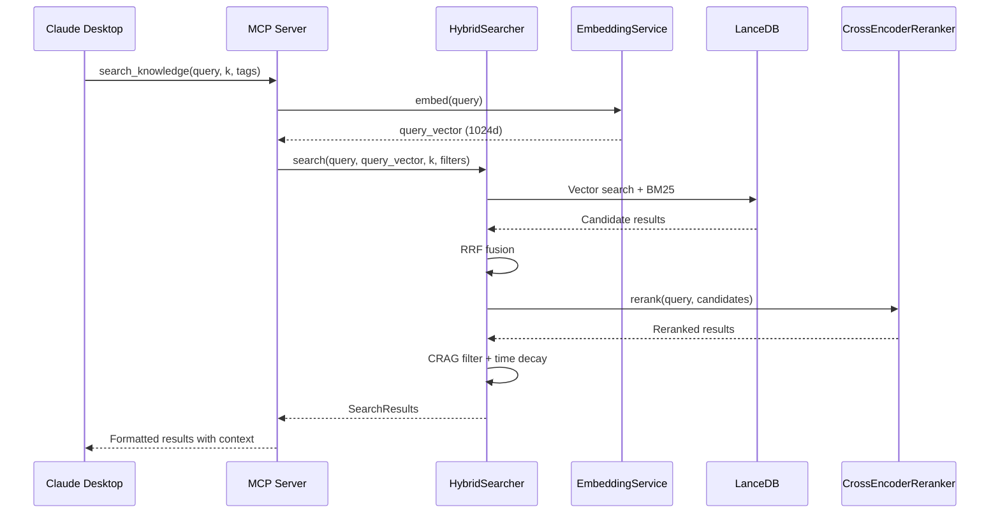

# System Architecture

> Technical architecture documentation for CoreRag.
> Follows the [C4 Model](https://c4model.com/) with Mermaid.js diagrams.

---

## 1. System Context (C4 Level 1)

How CoreRag fits into the broader ecosystem.

---

## 2. Container Architecture (C4 Level 2)

The logical containers that compose CoreRag.

---

## 3. Key Design Decisions

| Decision | Choice | Why | Alternatives Considered |
|----------|--------|-----|------------------------|
| Vector database | LanceDB (embedded) | Zero-config, Lance columnar format, native hybrid search | ChromaDB (less mature FTS), Qdrant (server overhead) |
| Embedding model | BAAI/bge-m3 (1024d) | Strong multilingual, MPS-optimized, good retrieval benchmarks | all-MiniLM-L6-v2 (384d, lower quality), OpenAI ada-002 (cloud dependency) |
| LLM provider | Ollama (local, qwen3:32b) | Privacy-preserving, no API costs, runs well on M4 Max | Claude API (better quality but sends data externally), Gemini API (same concern) |
| PII detection | Three-layer (Presidio + custom dict + LLM) | Defense in depth — NER catches patterns, dictionary catches known terms, LLM catches context | Single-layer Presidio (misses custom terms), LLM-only (unreliable for structured patterns) |
| Search fusion | RRF (Reciprocal Rank Fusion) | Simple, effective, no hyperparameter tuning needed | Linear combination (requires weight tuning), Borda count (less robust) |
| MCP transport | stdio | Claude Desktop native, no network setup | HTTP/SSE (requires server management, port conflicts) |
| Chunking | Parent-child hierarchical | Preserves document context, enables multi-resolution retrieval | Fixed-size (loses context), sentence-level (too granular) |

---

## 4. Data Flow

### Ingestion Pipeline

### Search Flow

---

## 5. Security Posture

| Concern | Approach |
|---------|----------|
| Authentication | API key via `X-API-Key` header (optional — omit for open local access). Manifest endpoint always public. |
| Secrets Management | `.env` file (gitignored), loaded via python-dotenv. Template at `.env.example`. |
| Data at Rest | LanceDB + SQLite stored in `~/.corerag/` with user-level permissions. macOS FileVault for disk encryption. |
| Data in Transit | Localhost-only binding (`127.0.0.1:8000`). Ollama on `localhost:11434`. No external network calls by default. |
| PII Protection | Three-layer detection (Presidio NER + custom dictionary + LLM advisory). Redacted exports. `CUI_` filename prefix. |
| Input Validation | Query length limits, parameter validation on all API endpoints, path traversal prevention. |
| Rate Limiting | slowapi on REST API endpoints. |
| Memory Safety | Auto-pause at 75% RAM, resume at 65%. GC between files. Notification cooldown on pressure alerts. |

---

## 6. Technology Stack

| Layer | Technology | Purpose |
|-------|-----------|---------|
| Language | Python 3.12+ | Primary implementation |
| Web Framework | FastAPI + Jinja2 | REST API + dashboard |
| Vector Database | LanceDB (embedded) | Hybrid vector + full-text storage |
| Knowledge Graph | SQLite | Bitemporal entity-relationship store |
| Embeddings | BAAI/bge-m3 (1024d) | Semantic vector representations |
| Reranker | cross-encoder/ms-marco-MiniLM-L-6-v2 | Post-retrieval relevance scoring |
| LLM | Ollama (qwen3:32b) | Document classification, contextual retrieval |
| PII Detection | Presidio + spaCy (en_core_web_lg) | NER-based entity detection |
| Audio | mlx-whisper | Apple Silicon speech-to-text |
| OCR | Vision.framework | Native macOS text extraction |
| MCP | FastMCP | Claude Desktop integration (stdio) |
| Rate Limiting | slowapi | API endpoint protection |
| CI/CD | GitHub Actions | Lint, test (matrix), security scan, build |
| Testing | pytest | Unit + integration with coverage |

---

## 7. Component Interaction

### Search Request via MCP

---

*This document is updated when architectural decisions change.*
